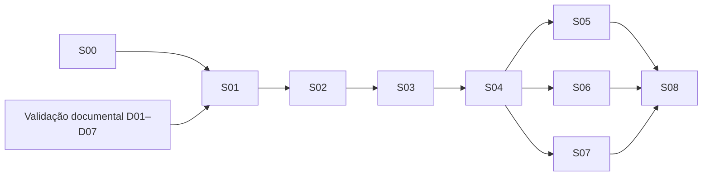

# Harness de implementação — Nexo

Ponto de retomada local de S00, em 19/09/2026. Entrega exclusivamente operacional: nenhuma regra de aprovação, migração ou refatoração do produto foi implementada.

## Comece aqui

1. Confira `git status --short` e `git log -5 --oneline`, depois leia [progress.md](progress.md) e [feedback.md](feedback.md). O histórico de Git e os arquivos presentes devem sustentar o relato; não presumir commit de alterações locais.
2. Consulte [feature-list.json](feature-list.json): escolha somente o slice autorizado, ainda não aprovado e com dependências e condições documentais satisfeitas. Hoje S01 está bloqueado por `VAL-001`.
3. Execute `node .agents/harness/init.mjs` na raiz. O script confere ambiente e registros sem instalar, migrar, resetar ou iniciar servidor.
4. Carregue [instruções](../../AGENTS.md), regras comuns e bloco do [slice atual](../../doc-specs/implementation-slices.md), [handoff](handoff.md) dos bloqueadores diretos e pontos do [mapa](mapa-de-impacto.md). Expanda fontes somente conforme necessário.
5. Siga o ciclo abaixo e encerre atualizando progresso, feedback, evidências e handoff.

## Artefatos e ciclo de trabalho

| Artefato | Papel |
| --- | --- |
| [feature-list.json](feature-list.json) | Estado estruturado S00–S08, dependências, Source IDs exatos, critérios e verificações extraídos do plano, `passes` e evidências |
| [progress.md](progress.md) | Diário cronológico de sessões, resultados observados e próximo passo |
| [feedback.md](feedback.md) | Problema observado → ação → verificação → resolução ou pendência |
| [init.mjs](init.mjs) | Entrada executável de preparação, sem mutação de dados |
| [verify.mjs](verify.mjs) | Verifica JSON, fontes, critérios, dependências, evidências e links; não comprova aceite funcional |
| [baseline.md](baseline.md) | Resultados anteriores à mudança e reprodução dos comandos existentes |
| [handoff.md](handoff.md) | Contratos e contexto mínimo para o próximo slice |
| [mapa-de-impacto.md](mapa-de-impacto.md) | Requisitos → pontos reais do código → testes existentes ou necessários |

**Observar → selecionar → agir → verificar → registrar.** Observar Git, progresso e feedback; selecionar uma entrega autorizada; agir dentro dela; verificar o resultado com testes pertinentes; registrar evidência e próximo passo. Uma falha retorna ao diagnóstico do mesmo slice. Se houver bloqueio externo, registrá-lo sem trocar o resultado por sucesso.

Para conferir o estado da aplicação, reutilizar `npm.cmd run validate` e `npm.cmd run test:e2e` com isolamento e servidor de desenvolvimento parado, conforme baseline. Para uso manual, `npm.cmd run dev` inicia o servidor; encerrá-lo antes da validação. Não chamar o servidor E2E diretamente sem a configuração isolada do Playwright.

Durante um slice, atualizar somente `passes` e `evidence` da sua entrada no JSON. Não remover critérios, alterar dependências ou reescrever descrições para fazer a entrega passar. Se a fonte mudar, registrar feedback, atualizar PRD/spec/plano conforme a decisão real e sincronizar explicitamente o JSON e seus hashes. Um hash atualizado sem rever os critérios não resolve divergência.

`passes: true` exige evidências de todos os critérios do slice, incluindo testes pertinentes e revisão do diff. Para S00, os critérios permitem baseline com impedimento concreto registrado; por isso S00 pode passar com B02 pendente. S01–S08 continuam `false`; falta de Chromium nunca comprova uma jornada. `VAL-001` só muda mediante registro real no PRD de D01–D07, especialmente D04; a atualização do JSON sozinha não cria esse aceite.

Ao encerrar, acrescentar a sessão a `progress.md`, ligar a evidência no JSON, atualizar feedback e o handoff do slice. Revisar `git diff` e arquivos não rastreados. Não afirmar commit inexistente nem descartar mudanças do participante para limpar a árvore.

## Referência e adaptação

Leituras em 19/09/2026: [guia indicado](https://harness-guide.com/guide/what-is-harness/), seu [padrão de inicialização](https://harness-guide.com/guide/initializer-coding-pattern/) e a [referência original da Anthropic](https://www.anthropic.com/engineering/effective-harnesses-for-long-running-agents). Aplicamos memória persistente, lista estruturada, inicialização e verificação por sessão à infraestrutura existente. `progress.md`, `feedback.md` e Node.js são escolhas locais; os nomes não são requisitos de produto. Não foi criado outro runtime de agentes, serviço, SDK ou orquestração multiagente.

## Fontes e revisão consultada

Branch: `feat/implementacao-aprovacao-orcamento`. HEAD inicial: `9c3cc4898ee6a1c7657499e4a70a3573f6aeef46`. O único arquivo inicialmente fora do controle de versão era o plano `doc-specs/implementation-slices.md`; seu conteúdo foi preservado. Os hashes abaixo identificam os bytes consultados, inclusive desse plano.

| Fonte | Revisão / SHA-256 |
| --- | --- |
| [PRD-v1](../../doc-specs/PRD-v1.md), especialmente §§9 e 12 | Último commit: `52441377160a3fccaf78f7334288fa548cd99c69`; SHA-256: `D51540C8092168590F79098A66A1B6F9BE28300AF7399D4387588357B4B1138D` |
| [spec-v1](../../doc-specs/spec-v1.md), §§1.1, 4.1, 6, 7.1 e 10 | Último commit: `006bd5579b31d6cbfdcfba9867f9098701dcbd04`; SHA-256: `2BE9315D82E17E6501C9EF3E8DBCD0A37E2A86DA446F6B0757B3C89E4FD6767F` |
| [Plano S00–S08](../../doc-specs/implementation-slices.md), regras comuns, S00 e matriz final | Arquivo local preexistente; SHA-256: `7687156182126E4E4430E294DF1305B96886D7F619E59D9686952088586BEE5C` |

Guias aplicáveis: [contexto](../../docs-agents/contexto.md), [arquitetura](../../docs-agents/arquitetura.md), [validação](../../docs-agents/validacao.md) e [glossário](../../CONTEXT.md). Consultados também os guias instalados de [Route Handlers](../../node_modules/next/dist/docs/01-app/01-getting-started/15-route-handlers.md) e [Playwright](../../node_modules/next/dist/docs/01-app/02-guides/testing/playwright.md); estes links dependem de `node_modules` instalado pelo lockfile.

## Condição de negócio

**D01, D02, D03, D04, D05, D06 e D07: pendentes.** Não foi encontrado registro de aceite nas fontes consultadas. O aceite da estratégia de testes em PRD §9 não é aceite dessas decisões. D04 exige aceite expresso. Registrar a validação no PRD, conforme spec §1.1 / `VAL-001`, antes do comportamento dependente.

O texto histórico do PRD §12 afirma que a especificação estava pendente na elaboração do PRD. Hoje `spec-v1.md` existe na branch; isso resolve sua existência, mas não comprova validação de negócio ou aceite técnico. S00 não altera essas fontes silenciosamente.

## Dependências e pacote mínimo

As setas significam **depende de** (destino depende da origem). Fontes compartilhadas não criam dependências extras. O [mapa](mapa-de-impacto.md) relaciona fonte → slice → código → verificação; o [progresso](progress.md) distingue evidência de pendência.

Pacote de cada sessão: regras comuns → slice atual → handoffs dos bloqueadores diretos → trechos dos Source IDs → contratos da leitura focal → código e testes envolvidos. Incluir todas as linhas dos exemplos parametrizados aplicáveis. Evitar carregar PRD, spec e plano integralmente. Se houver contradição, repetição de investigação ou perda de regras, registrar handoff parcial e retomar o mesmo slice em contexto novo.

## Limites de alteração

- Preservar dados do participante, IDs, pessoas, valores, versões, datas, contador e histórico; seed imutável. Não executar reset dos dados do participante, apagar travas indiscriminadamente ou importar solução de outra branch.
- Mutações passam por `JsonStore.update`; identidade, permissões e regras são verificadas no backend. Estado e histórico precisam ser persistidos na mesma transação.
- Manter JSON local, endpoint existente, Node.js 24 e dependências do lockfile. Não adicionar banco, Docker, autenticação real, serviços externos ou infraestrutura de idempotência.
- Testes usam diretórios temporários e `.local/e2e/`, nunca `.local/demands.json`. A reinicialização interna do harness E2E e o teste de reset existente ficam restritos a dados de teste, conforme [baseline](baseline.md).
- Não disponibilizar escrita v2 sem leitor compatível; substituir leitor, comandos e interface coordenadamente, com escritores antigos parados. S00 preserva o comportamento v1, inclusive o início direto existente; S01 deverá protegê-lo.
- Não atualizar dependências para contornar falhas de ambiente. Não remover testes para esconder falhas. Baseline aprovada não é aceite de `PRD: C01–C42` ou `SPEC: AC-001–AC-018`.
