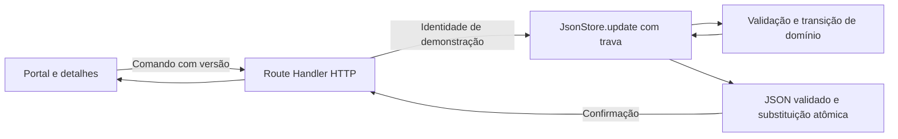

# Introdução

Esta especificação define a evolução do Nexo para exigir aprovação do valor solicitado antes do início de uma demanda. Traduz o PRD v1 em estados, contratos, invariantes, migração, responsabilidades e verificações executáveis. A aprovação não inicia nem conclui a execução e não representa pagamento ou reserva de saldo.

Base examinada: branch `feat/implementacao-aprovacao-orcamento`, com domínio TypeScript, validação Zod, Route Handlers Next.js e armazenamento JSON transacional. O código atual contém somente os comandos `create`, `update` e `advance`, com `schemaVersion: 1`; os elementos de aprovação descritos abaixo são propostas de implementação.

## 1. Propósito e escopo

**Objetivo:** entregar o fluxo completo de envio, decisão, correção, reenvio e execução, preservando dados e jornadas existentes, com alterações concentradas na arquitetura atual.

**Público:** pessoas responsáveis por desenvolvimento, revisão técnica, validação de produto e testes, incluindo agentes de programação.

**Escopo obrigatório:** backend autoritativo, interface em português, aprovação por gestor selecionado, histórico de ciclos, bloqueio e invalidação do valor, concorrência, recuperação de falhas e compatibilidade com dados anteriores.

**Fora de escopo:** autenticação real, banco de dados, Docker, serviços externos, notificações, pagamentos, alçadas, múltiplos aprovadores, expiração, aprovação automática, exclusão de histórico e reabertura de demandas.

### 1.1 Premissas e pendências de produto

O pedido de elaboração autoriza este documento, mas não comprova aprovação das propostas D01–D07 do PRD. Esta especificação adota essas propostas como premissas explícitas:

| Decisão do PRD | Premissa técnica |
| --- | --- |
| D01 | Cada ciclo tem um único gestor, diferente do solicitante; somente ele decide. |
| D02 | Trocar o gestor encerra a pendência anterior e abre outro ciclo atomicamente. |
| D03 | Autoaprovação e autorrejeição são proibidas. |
| D04 | Somente mudança efetiva do valor invalida a aprovação ou pendência. |
| D05 | Rejeição admite reenvio sem edição prévia. |
| D06 | Valor válido: 1 a 100.000.000 centavos, inclusive. |
| D07 | Execução e aprovação são estados independentes na interface. |

Antes de implementar, registrar a validação dessas decisões no PRD da branch de trabalho. D04 merece aceite expresso: uma alteração substancial da descrição pode manter uma aprovação, pois ela autoriza o valor. Se uma decisão mudar, atualizar os contratos e testes afetados antes de escrever o comportamento dependente. Não presumir que a solução de outra branch representa o estado atual.

## 2. Definições

| Termo | Definição |
| --- | --- |
| Demanda | Necessidade interna registrada no portal. |
| Solicitante | Pessoa identificada por `requesterId`; mantém a titularidade da demanda. |
| Gestor | Perfil fictício com `role: "gestor"`; não recebe permissão de editar demandas alheias. |
| Valor solicitado | Quantia inteira em centavos apresentada para avaliação, em reais brasileiros. |
| Ciclo de avaliação | Um envio identificado por UUID, com gestor e valor fixados naquele envio. |
| Aprovação válida | Decisão favorável do ciclo atual, não invalidada, cujo valor corresponde ao valor atual. |
| Invalidação | Encerramento da validade de uma pendência ou aprovação por mudança de valor. Não apaga decisão. |
| Reencaminhamento | Substituição explícita do gestor de uma avaliação pendente por outro gestor elegível. |
| Versão da demanda | Contador inteiro usado para recusar comandos baseados em estado desatualizado. |
| Versão do esquema | Número que identifica o formato persistido; não é a versão da demanda. |
| Transação local | Leitura, validação, alteração e gravação protegidas pela mesma trava de arquivo. |
| API / HTTP | Interface de programação e protocolo usados entre navegador e servidor. |
| UUID / UTC | Identificador único e referência temporal universal; datas persistidas em ISO 8601 UTC. |
| E2E | Teste da jornada completa pelo navegador. |
| Repetição segura | Repetir um comando antigo não duplica seu efeito; pode resultar em conflito, sem reproduzir resposta de sucesso. |

## 3. Requisitos, restrições e diretrizes

### 3.1 Requisitos rastreáveis

Os identificadores RN e C referem-se às regras e aos cenários do PRD. Os requisitos abaixo são normativos, respeitadas as premissas da seção 1.1.

| ID | Requisito | Origem |
| --- | --- | --- |
| REQ-001 | Criar como Nova / Não enviada; criação e edição não enviam automaticamente. | RN01–RN02 |
| REQ-002 | Somente o solicitante envia, reenvia e reencaminha; validar gestor existente, elegível e diferente dele. | RN02–RN05, RN22 |
| REQ-003 | Manter no máximo uma avaliação pendente; somente seu gestor pode decidir. | RN03–RN05 |
| REQ-004 | Rejeitar exige justificativa após `trim`; aprovar não exige justificativa. Decisão encerra o ciclo pendente. | RN06–RN07 |
| REQ-005 | Iniciar exige aprovação válida para o valor atual; somente o solicitante inicia e conclui. | RN08, RN14 |
| REQ-006 | Mudar valor antes do início invalida pendência ou aprovação; retornar ao valor anterior não restaura validade. | RN09–RN10 |
| REQ-007 | Valor equivalente não invalida; demais campos permanecem editáveis até conclusão sem invalidar. | RN10, RN13 |
| REQ-008 | Depois do primeiro início, bloquear mudança do valor, inclusive em demandas legadas dispensadas. | RN11 |
| REQ-009 | Permitir novo ciclo após rejeição ou invalidação, sem apagar histórico ou exigir alteração artificial. | RN12 |
| REQ-010 | Registrar envios, decisões, troca de gestor e invalidação com pessoa, momento, ciclo e valores pertinentes. | RN15–RN16 |
| REQ-011 | Recusar comandos desatualizados e repetições de decisões/transições sem alterações parciais. | RN17–RN19 |
| REQ-012 | Migrar dados antigos uma única vez: Nova exige aprovação; Em andamento é dispensada; Concluída permanece consultável. | RN20–RN21 |
| REQ-013 | Não reenviar pendência ao mesmo gestor; trocar para outro encerra a anterior atomicamente. | RN23 |
| REQ-014 | Distinguir execução/aprovação, mostrar justificativas e permitir localizar avaliações destinadas ao gestor atual. | Seções 6–7 do PRD |
| REQ-015 | Preservar busca, filtros, teclado, mensagens legíveis, largura pequena e conteúdo digitado diante de falha. | Seção 7, C40–C41 |

### 3.2 Segurança e integridade

- **SEC-001:** identificar a pessoa pelo `x-demo-user` e consultar nome e papel no servidor. Nunca aceitar papel, solicitante, decisão pronta, dispensa, histórico ou datas fornecidos pelo cliente.
- **SEC-002:** validar comando com união discriminada Zod e objetos estritos. Não usar coerção de números ou asserções TypeScript como substituto de validação em execução.
- **SEC-003:** validar permissões, versão, ciclo e estado dentro de `JsonStore.update`; botões bloqueados são apenas orientação.
- **SEC-004:** preservar validação de origem, tipo de conteúdo e limite de corpo existentes; origem malformada deve ser erro controlado, sem expor detalhes internos.
- **SEC-005:** renderizar justificativas como texto, sem HTML interpretado. Cabeçalho de demonstração não é autenticação; o ambiente continua restrito ao uso local com dados fictícios.
- **SEC-006:** recusa de domínio não modifica valores, versão, ciclos ou histórico persistidos. Não registrar tentativas recusadas como decisões de negócio.

### 3.3 Restrições e diretrizes arquiteturais

- **CON-001:** manter Node.js 24, TypeScript e Next.js instalados; não atualizar dependências para realizar a história.
- **CON-002:** manter armazenamento local JSON, `DEMANDS_DATA_FILE`, seed imutável durante uso e trava entre processos no mesmo sistema de arquivos.
- **CON-003:** não executar reset, substituir dados do participante, importar solução de referência ou introduzir serviço externo para cumprir a especificação.
- **CON-004:** nenhum novo estado deve alterar as três colunas de execução: Nova, Em andamento e Concluída.
- **PAT-001:** separar contrato, regras de negócio, adaptação HTTP, persistência e apresentação. Usar funções pequenas com transições explícitas, sem criar repositórios genéricos ou infraestrutura distribuída.
- **PAT-002:** usar esquemas Zod como fonte dos tipos por `z.infer`, uniões discriminadas e tratamento exaustivo de comandos e estados.
- **GUD-001:** manter uma chamada de mutação e uma atualização de consulta por ação, sem consulta por cartão. Não introduzir cache de decisões ou escrita otimista de aprovações.
- **GUD-002:** medir antes de otimizar; o arquivo inteiro e a trava global limitam escala. Escala horizontal, arquivo em rede e grande volume não são garantias desta v1.

## 4. Interfaces e contratos de dados

### 4.1 Componentes e responsabilidades



| Arquivo | Alteração prevista |
| --- | --- |
| `src/domain/model.ts` | Esquemas v1/v2, aprovação, ciclos, eventos estruturados e novos comandos. |
| `src/domain/demands.ts` | Despacho explícito por comando; permissões específicas; transições e bloqueios. |
| `src/domain/approval.ts` — novo | Predicados de aprovação válida, elegibilidade e transições de avaliação, sem acesso a arquivos. |
| `src/domain/migrations.ts` — novo | Conversão pura e validada de v1 para v2. |
| `src/domain/currency.ts` | Preservar centavos inteiros, conversão e exibição existentes. |
| `src/server/json-store.ts` | Carregamento por versão, backup e migração sob a mesma trava. |
| `src/server/http.ts` | Novos comandos, erros úteis e preservação do contrato HTTP. |
| `src/app/api/demands/route.ts` | Manter endpoint e execução Node.js, sem cache dos dados locais. |
| `src/components/portal.tsx` | Consulta, mutação, tratamento de conflito e filtro de avaliações do gestor. |
| `src/components/demand-detail.tsx` | Situação de aprovação, seleção de gestor, decisões e histórico. |
| `src/components/demand-form.tsx` | Bloqueio monetário após início e aviso antes de invalidar. |
| `src/components/shared.tsx` | Apresentação textual reutilizável da situação de aprovação. |
| `tests/*.test.ts`, `tests/e2e/` | Aceite, integração, regressão, migração e falhas. |

A verificação global atual de titularidade em `applyCommand` deve passar a ser específica por comando: gestores podem decidir demandas alheias, mas continuam sem poder editá-las ou movimentá-las. Não remover a verificação de titularidade das ações existentes.

Manter as fronteiras de componentes atuais: código de arquivo e `node:crypto` apenas no servidor/domínio servidor; componentes cliente importam contratos e utilitários compatíveis. Não migrar para Server Actions nem adicionar outra superfície de mutação. Consultar os guias locais do Next.js antes da implementação; a documentação instalada já confirma Route Handlers com `Request`/`Response` e execução Node.js.

### 4.2 Esquema persistido v2

Preservar campos atuais de `Database` e `Demand`. `schemaVersion` passa a `2`; cada demanda recebe `approval`. `nextId`, usuários, IDs, datas e eventos legados mantêm seus valores na migração.

Contrato conceitual TypeScript; os esquemas Zod equivalentes são obrigatórios na implementação:

```ts
type PersonSnapshot = { id: string; name: string };
type Decision =
  | { outcome: "approved"; by: PersonSnapshot; at: string }
  | { outcome: "rejected"; by: PersonSnapshot; at: string; reason: string };

type Closure = {
  reason: "amount_changed" | "manager_changed";
  by: PersonSnapshot;
  at: string;
};

type EvaluationCycle = {
  id: string; // UUID gerado no servidor
  manager: PersonSnapshot;
  amountCents: number; // valor fixado no envio
  submittedBy: PersonSnapshot;
  submittedAt: string;
  decision: Decision | null;
  closure: Closure | null;
};

type Approval =
  | {
      policy: "required";
      state: "not_submitted";
      currentCycleId: null;
      cycles: [];
    }
  | {
      policy: "required";
      state: "pending" | "approved" | "rejected" | "resubmission_required";
      currentCycleId: string;
      cycles: EvaluationCycle[];
    }
  | {
      policy: "legacy_started" | "legacy_completed";
      migratedAt: string;
      cycles: [];
      currentCycleId: null;
    };
```

Regras de validação além da forma dos objetos:

1. Valores monetários são inteiros seguros de 1 a 100.000.000; datas são ISO 8601 UTC; IDs de ciclos são únicos na demanda.
2. `currentCycleId` aponta para o último ciclo de `cycles`, que nunca é removido. Todos os ciclos anteriores estão decididos ou encerrados.
3. Um ciclo está pendente se `decision === null && closure === null`. No máximo um ciclo atende a essa condição; ele corresponde a `state: "pending"`.
4. `approved` exige decisão favorável e ausência de encerramento, com valor do ciclo igual ao da demanda. `rejected` exige decisão desfavorável e ausência de encerramento; seu valor pode diferir do atual após correção.
5. `resubmission_required` exige encerramento `amount_changed` no ciclo atual; uma decisão favorável anterior permanece intacta. `manager_changed` só encerra ciclo sem decisão e exige um novo ciclo atual.
6. Decisão é atribuída ao gestor do ciclo, diferente do solicitante; envio é atribuído ao solicitante. Validar papel atual do gestor ao enviar e decidir; nomes e identidades históricos são snapshots, não recalculados da lista de perfis.
7. `legacy_started` só existe em Em andamento ou Concluída; `legacy_completed` só em Concluída. Não há comando público que conceda essas condições.
8. Com política `required`, Em andamento e Concluída exigem aprovação válida preservada. Sem reabertura, esses estados bastam para bloquear valor após o primeiro início; não inventar data de início para dados legados.
9. Justificativa: string com `trim`, mínimo 1 e máximo 2.000 caracteres após normalização. O limite superior é decisão técnica desta especificação, alinhada ao limite atual de descrição, não uma regra já expressa no PRD.
10. `decision` é escrita no máximo uma vez. `closure` é escrita no máximo uma vez. Um ciclo rejeitado não recebe invalidação por mudança de valor; a correção conserva a rejeição até o novo envio.

`state` é uma projeção armazenada para simplificar a interface; seu acordo com os ciclos deve ser validado na leitura e antes da escrita. Não aceitar combinações inválidas nem corrigi-las silenciosamente. Ciclos guardam os fatos da avaliação; o histórico registra sua sequência visível. Ambos são atualizados na mesma transação.

### 4.3 Histórico

Preservar integralmente eventos `created`, `updated`, `started` e `completed` já existentes. Novos eventos mantêm `id`, `actorId`, `actorName`, `at`, `kind` e `message`, acrescentando `details` tipado por `kind`:

| `kind` | `details` obrigatório | Uso |
| --- | --- | --- |
| `approval_submitted` | `cycleId`, `managerId`, `managerName`, `amountCents`, `previousCycleId: string \| null` | Envio inicial ou reenvio. |
| `approval_reassigned` | `previousCycleId`, `cycleId`, gestores anterior/novo com ID/nome, `amountCents` | Um único evento identifica encerramento e novo envio na troca. |
| `approval_approved` | `cycleId`, `amountCents` | Pessoa e data vêm dos campos comuns. |
| `approval_rejected` | `cycleId`, `amountCents`, `reason` | Mesma justificativa salva na decisão. |
| `approval_invalidated` | `cycleId`, `previousAmountCents`, `amountCents` | Invalidação por valor. |
| `updated` — novos registros | `previousAmountCents`, `amountCents` | Mudança de valor identificável, mesmo sem ciclo ativo. |

Nos novos eventos `updated`, ambos os valores existem e podem ser iguais quando outro campo muda. Nos eventos legados, `details` continua opcional; não fabricar valores históricos desconhecidos. Mensagens devem ser em português e não devem ser analisadas como fonte das regras.

Uma edição que invalida gera `updated` seguido de `approval_invalidated`, com o mesmo instante e uma única incrementação de versão. Uma troca de gestor gera `approval_reassigned`, sem duplicar `approval_submitted`. Ordem do array é a ordem histórica quando timestamps coincidem. A migração não acrescenta evento de pessoa fictícia: a dispensa é indicada por `policy` e `migratedAt`.

### 4.4 Máquina de estados

Todas as linhas pressupõem pessoa autorizada, versão atual e execução Nova, salvo indicação contrária. Demais combinações são recusadas.

| Estado atual | Comando/evento | Resultado |
| --- | --- | --- |
| Não enviada | Enviar a gestor elegível | Novo ciclo pendente. |
| Aguardando avaliação | Aprovar ciclo atual | Aprovada; execução continua Nova. |
| Aguardando avaliação | Rejeitar com justificativa | Rejeitada; execução continua Nova. |
| Aguardando avaliação | Enviar a outro gestor | Encerrar ciclo por troca; criar novo ciclo pendente. |
| Aguardando avaliação | Enviar ao mesmo gestor | Conflito; nenhuma versão ou evento novo. |
| Aprovada | Enviar novamente | Conflito; reenvio sem invalidação fora da v1. |
| Rejeitada / Reenvio necessário | Enviar | Novo ciclo pendente, inclusive sem edição prévia. |
| Aguardando avaliação / Aprovada | Mudar valor | Encerrar validade por valor; Reenvio necessário. |
| Não enviada / Rejeitada / Reenvio necessário | Mudar valor | Manter estado; registrar valores anterior e novo. |
| Qualquer estado de aprovação | Editar sem mudar valor | Manter aprovação; respeitar bloqueio de edição da Concluída. |
| Aprovada válida | `advance` | Em andamento, sem alterar ciclo. |
| Em andamento aprovada ou dispensada | `advance` | Concluída; preservar aprovação/dispensa. |

Não há cancelamento de aprovação, prazo de validade, retirada de envio ou mudança automática de gestor.

### 4.5 Comandos e HTTP

Preservar `GET /api/demands` e `POST /api/demands`. GET retorna o documento v2 completo com `Cache-Control: no-store`, sem criar API por cartão. Cliente mantém `fetch` sem cache. POST usa `Content-Type: application/json` e `x-demo-user`.

Preservar comandos atuais e adicionar:

```ts
type Target = { id: string; version: number };
type ApprovalCommand =
  | ({ type: "submitApproval"; managerId: string } & Target)
  | ({ type: "approveBudget"; cycleId: string } & Target)
  | ({ type: "rejectBudget"; cycleId: string; reason: string } & Target);
```

`submitApproval` atende envio inicial, reenvio e troca. `cycleId` identifica exatamente a avaliação apresentada ao gestor; valor, gestor decisor, datas e resultado são derivados do documento e do comando pelo servidor. Não aceitar esses campos como autoridade do cliente.

Comandos existentes: `create { input }`, `update { id, version, input }` e `advance { id, version }`. `input` mantém título de 3 a 120 caracteres após `trim`, descrição de até 2.000, área e prioridade dos enums atuais e `amountCents` inteiro válido. `advance` continua sequencial: Nova → Em andamento → Concluída, sem aceitar situação destino arbitrária.

| Resposta | Contrato / condição |
| --- | --- |
| 201 | `{ "demand": DemandV2 }` após criação salva. |
| 200 | `{ "demand": DemandV2 }` após mutação salva; GET retorna `DatabaseV2`. |
| 400 | JSON/esquema inválido, justificativa inválida, gestor destino inexistente ou não elegível. |
| 403 | Perfil inexistente, ação de terceiro, decisão fora do gestor selecionado, autoavaliação ou origem proibida. |
| 404 | Demanda não encontrada. |
| 409 | Versão ou ciclo desatualizado, transição inválida, valor bloqueado, início sem aprovação ou envio redundante. |
| 413 / 415 | Corpo acima do limite atual de 20.000 caracteres / tipo de conteúdo incompatível. |
| 503 | Trava indisponível, arquivo inválido, esquema desconhecido, migração ou acesso ao armazenamento indisponível. |
| 500 | Falha inesperada; mensagem genérica, detalhes somente no terminal. |

Erros preservam `{ error: string }` e acrescentam `code: string` estável. Códigos mínimos: `INVALID_COMMAND`, `FORBIDDEN`, `NOT_FOUND`, `VERSION_CONFLICT`, `CYCLE_CONFLICT`, `INVALID_TRANSITION`, `APPROVAL_REQUIRED`, `AMOUNT_LOCKED`, `MANAGER_NOT_ELIGIBLE`, `ALREADY_PENDING`, `STORE_UNAVAILABLE`. Códigos de transporte podem ser `INVALID_ORIGIN`, `PAYLOAD_TOO_LARGE` e `UNSUPPORTED_MEDIA_TYPE`; falha inesperada usa `INTERNAL_ERROR`.

Ordem determinística: validar transporte e forma; dentro da trava, resolver pessoa/demanda, conferir versão, verificar permissões específicas e ciclo, validar estado/valor e só então alterar. Conflito de versão pode preceder erro de permissão em uma requisição antiga, como no comportamento atual; uma tentativa atual de autoavaliação deve produzir 403. Gestor destino igual ao solicitante é `MANAGER_NOT_ELIGIBLE`/400 no envio, sem encerrar pendência anterior.

Exemplo de decisão:

```json
{
  "type": "rejectBudget",
  "id": "DEM-9",
  "version": 2,
  "cycleId": "73f6c8a3-6c69-4bc6-99f5-72563a8efcab",
  "reason": "Revisar o valor solicitado."
}
```

Exemplo de conflito:

```json
{
  "error": "Esta demanda foi atualizada em outra tela. Atualize e revise os dados antes de tentar novamente.",
  "code": "VERSION_CONFLICT"
}
```

### 4.6 Concorrência e repetição

Cada comando aceito incrementa `version` exatamente uma vez, inclusive troca de gestor e edição com invalidação. Criação começa em 1. Migração não incrementa versões de demandas, pois não é ação do participante. Comando recusado não incrementa versão nem grava evento.

O ciclo completo deve ocorrer dentro de `JsonStore.update`: adquirir trava → carregar/migrar → validar versão e regras → aplicar mudança e eventos → validar documento → escrever temporário → sincronizar arquivo → renomear → liberar trava → responder.

- Duas decisões com a mesma versão: a primeira persistida prevalece; a segunda recebe 409.
- Decisão versus edição ou início versus mudança de valor: somente uma operação baseada na versão inicial vence. A seguinte deve ser revisada manualmente, mesmo quando a edição era apenas textual.
- Ciclo antigo nunca pode ser decidido após troca de gestor ou reenvio, ainda que alguém envie uma versão atual com `cycleId` antigo.
- Repetição com versão antiga recebe 409; repetição de envio ao mesmo gestor com versão atual recebe `ALREADY_PENDING`/409. Ambas preservam o ciclo original.
- Não acrescentar chave de idempotência ou tabela de recibos: versão e identidade de ciclo satisfazem os cenários de repetição do PRD. Isso garante efeito único para esses comandos, não repetição da mesma resposta HTTP.
- `create` continua sem deduplicação por chave. Não repetir criação automaticamente após perda de resposta; consultar as demandas primeiro. Deduplicação geral de criação é evolução independente, não promessa desta especificação.

### 4.7 Migração e operação do armazenamento

Implementar migração v1 → v2 na primeira leitura ou mutação, sob a trava existente. Não inferir dispensa comparando datas a um relógio de implantação.

1. Ler o arquivo de trabalho e identificar `schemaVersion` sem descartar campos. Validar pela definição correspondente. Arquivo inválido ou versão desconhecida produz erro explícito e permanece intacto.
2. Para v1, converter em memória com uma única data de migração: Nova recebe `required/not_submitted`; Em andamento recebe `legacy_started`; Concluída recebe `legacy_completed`. Todos recebem `cycles: []` e `currentCycleId: null`.
3. Preservar todos os dados anteriores: IDs, pessoas, `nextId`, valor, situação, versão, datas e eventos na mesma ordem. Campos adicionais preexistentes não podem ser silenciosamente removidos pelo parse: preservá-los como extensões ou recusar a adaptação explicitamente, antes de qualquer escrita.
4. Validar integralmente a saída v2 e invariantes. Criar backup exclusivo dos bytes originais no mesmo diretório, por exemplo `demands.json.pre-v2.<uuid>.backup`; usar criação exclusiva, sem sobrescrever backup existente. Falha no backup impede substituição.
5. Gravar v2 pelo mecanismo existente de temporário no mesmo diretório, sincronização e renomeação. Somente após sucesso disponibilizar v2. Falha anterior ao renome preserva v1; nova tentativa pode criar outro backup, nunca eventos duplicados.
6. Em leituras v2, validar sem migrar ou reinterpretar políticas. `required` nunca vira `legacy_started` apenas porque a demanda está Em andamento ao reiniciar.
7. Se o arquivo de trabalho não existir, carregar a seed, validar/migrar em memória e gravar somente o arquivo de trabalho. A seed v1 pode continuar versionada; seus exemplos iniciados representam casos legados. Não regravar a seed nem executar reset automático.

Separar versão persistida de versão legada no carregador e nos testes: `databaseSchema` público passa a representar v2; helpers que hoje fazem parse direto da seed devem usar o carregador/conversor apropriado, preservando testes específicos da entrada v1.

Reset explícito existente continua fazendo backup antes de restaurar exemplos e deve persistir uma versão utilizável pelo novo carregador. Esta história não executa reset nos dados reais. Retorno a código antigo não pode consumir v2 silenciosamente: recuperação requer parar escritores, preservar o arquivo atual e escolher conscientemente um backup; restaurar backup antigo perde alterações posteriores e não é procedimento automático.

Falha anterior ao renome não confirma negócio. Falha depois do renome, inclusive ao liberar trava ou transmitir resposta, pode deixar resultado salvo: tratar como resposta incerta, consultar novamente e não repetir automaticamente. Uma trava remanescente não deve ser apagada indiscriminadamente; seguir a recuperação existente. Não prometer durabilidade absoluta contra queda de energia ou garantias de sistemas de arquivos distribuídos.

### 4.8 Interface e recuperação

| Contexto | Comportamento obrigatório |
| --- | --- |
| Cartão e detalhes | Mostrar execução e aprovação em textos separados; valor solicitado sempre visível. |
| Nova / Não enviada | Solicitante escolhe gestor e aciona “Enviar para avaliação”; seleção sem envio não salva ciclo. |
| Nenhum gestor elegível | Explicar “Não há outro gestor disponível para avaliar esta demanda”; preservar demanda e bloquear envio/início. |
| Pendente | Mostrar gestor e valor enviado; somente gestor selecionado vê ações de decisão, solicitante pode reencaminhar. |
| Rejeitada | Mostrar justificativa da última rejeição e permitir reenvio; histórico conserva justificativas anteriores. |
| Reenvio necessário | Explicar que o valor mudou e apresentar reenvio como próximo passo. |
| Aprovada | Mostrar valor aprovado; iniciar disponível somente ao solicitante em Nova. |
| Valor alterado em pendência/aprovação | Aviso antes de salvar; a ação de salvar confirma a alteração e sua invalidação, sem confirmação adicional obrigatória. |
| Em andamento | Valor somente leitura; outros campos editáveis pelo solicitante. |
| Concluída | Somente consulta; dispensa ou decisão preservada. |
| Legado dispensado | “Dispensada por início anterior à política” ou “Concluída antes da política”, sem decisão fictícia. |

Adicionar filtro “Aguardando minha avaliação” para perfil gestor: `pending` e gestor do ciclo igual ao perfil atual. Compor com busca, área e prioridade. Ao ativá-lo, desativar “Só minhas”, e vice-versa, pois ninguém avalia a própria demanda; mudança deve ser visível nos controles. Troca de perfil desativa o novo filtro e fecha contextos de ação, preservando a separação entre pessoas. O quadro mantém três colunas e os indicadores atuais mantêm sua semântica.

Usar rótulos associados aos controles, foco visível, modal com retorno de foco, navegação por teclado, mensagens `role="alert"`/`role="status"` e texto além de cor. Verificar largura de 360 px sem corte das ações ou rolagem horizontal da página.

Durante envio de comando, bloquear cliques repetidos e troca de perfil. Capturar pessoa, versão e ciclo do conteúdo revisado; não substituir silenciosamente esses dados após atualização em segundo plano. Após 409, recarregar dados e exigir revisão explícita antes de habilitar nova decisão. Preservar rascunho de justificativa/edição quando possível, distinguindo-o do estado salvo; não reaplicar automaticamente uma edição sobre a versão nova.

Após POST bem-sucedido, usar a demanda retornada como resultado confirmado e atualizar a listagem. Se a consulta seguinte falhar, informar “Alteração salva; não foi possível atualizar a lista”, sem tratar como falha da mutação. Se não houver resposta conclusiva do POST, mostrar “Não foi possível confirmar o resultado. Atualize a demanda antes de tentar novamente”. Cancelamento da requisição no navegador não equivale a cancelamento da transação.

## 5. Critérios de aceite

Cada critério deve ser verificado como resultado observável. A tabela cobre todos os cenários C01–C42 do PRD; exemplos parametrizados devem manter todas as suas linhas.

| ID | Dado / Quando / Então | Requisitos e cenários |
| --- | --- | --- |
| AC-001 | Dada criação válida, quando salva, então fica Nova / Não enviada e iniciar sem decisão é recusado em todos os valores aceitos. | REQ-001,005; C01,C03,C04 |
| AC-002 | Dado solicitante e gestor elegível, quando envia, aprova, inicia e conclui, então cada passo persiste isoladamente com histórico e sem execução automática. | REQ-002–005,010; C02 |
| AC-003 | Dada tentativa por pessoa indevida, quando usa a API diretamente, então autoavaliação, decisão por outro gestor e edição/movimentação alheia são recusadas sem mudança. | REQ-002,003,005; C05–C07 |
| AC-004 | Dada falta de gestor ou destino inválido, quando tenta enviar/reencaminhar, então recebe orientação e a pendência anterior, se houver, permanece. | REQ-002; C08,C14 |
| AC-005 | Dada pendência, quando rejeita sem conteúdo ou com mais de 2.000 caracteres, então não há decisão; com justificativa válida, então rejeita e conserva razão, autor, valor e data. | REQ-004,010; C09,C10,C42 |
| AC-006 | Dada rejeição, quando reenvia com ou sem edição em vários ciclos, então somente o último pode autorizar e todas as decisões permanecem consultáveis. | REQ-009,010; C09,C11,C12,C31 |
| AC-007 | Dada pendência, quando troca gestor, então encerra a anterior; quando repete envio ao mesmo gestor, então não cria ciclo ou evento adicional. | REQ-013; C13,C15 |
| AC-008 | Dada pendência/aprovação, quando aumenta ou reduz valor, então invalida; voltar ao valor antigo não restaura e decisão do ciclo antigo é recusada. | REQ-006; C16,C17,C20 |
| AC-009 | Dada demanda editável, quando salva valor equivalente ou somente outro campo, então mantém aprovação; novo valor após rejeição conserva rejeição até reenvio. | REQ-007,009; C09,C18,C19,C23 |
| AC-010 | Dada aprovação invalidada, quando reenvia e recebe nova aprovação, então pode iniciar pelo valor atual mantendo decisões anteriores. | REQ-005,006,010; C21 |
| AC-011 | Dada demanda iniciada ou concluída, quando tenta alterar valor, então recebe recusa; valor inválido antes do início também não invalida aprovação existente. | REQ-008; C22,C24 |
| AC-012 | Dadas duas telas com mesma versão, quando decidem, iniciam ou editam concorrentemente, então somente uma ação daquela versão prevalece e a outra exige revisão. | REQ-011; C25,C27,C28 |
| AC-013 | Dada decisão/transição salva, quando repete comando antigo, então não duplica decisão ou transição, inclusive após perder resposta. | REQ-011; C26,C30,C39 |
| AC-014 | Dada falha antes da substituição do arquivo, quando tenta enviar, decidir ou invalidar, então estado e histórico permanecem anteriores e uma nova tentativa é possível. | REQ-011; C29,C32,C33 |
| AC-015 | Dados documentos v1 nos três estados, quando migra e reinicia, então Nova exige aprovação, iniciada pode concluir e concluída permanece consultável, sem ampliar dispensa. | REQ-012; C34–C37 |
| AC-016 | Dado arquivo inválido ou falha de migração, quando carrega, então informa erro, preserva bytes originais e não restaura seed. | REQ-012; C38 |
| AC-017 | Dadas transições fora de ordem, quando chamadas diretamente, então recusa todas as combinações de C39 sem alteração. | REQ-003–005,008,011; C39 |
| AC-018 | Dado gestor usando teclado e largura pequena, quando filtra e decide, então identifica contexto, recebe mensagens compreensíveis e conserva busca/filtros e histórico completo. | REQ-014,015; C40–C42 |

## 6. Estratégia de automação de testes

### 6.1 Níveis e ferramentas

Usar a infraestrutura existente: `node:test`, `node:assert/strict`, execução TypeScript via `tsx` e Playwright com Chromium. Não adicionar framework para interpretar Gherkin; os cenários do PRD são referências para nomes e dados dos testes.

| Nível | Cobertura obrigatória |
| --- | --- |
| Domínio | Matriz de transições e permissões; todos os limites monetários; justificativa vazia, espaços e limite; ciclos e histórico; não restauração; edição textual; versões/ciclos inválidos. |
| Migração | v1 com três situações; preservação de campos e eventos; repetição de leitura v2; esquema desconhecido; dados adicionais; backup exclusivo; erro antes da substituição. |
| HTTP | Comandos estritos, pessoa derivada do cabeçalho, adulteração de campos, códigos e status, origem, corpo e tipo de conteúdo; nenhum endpoint contorna aprovação. |
| Armazenamento | Duas instâncias de `JsonStore` sobre arquivo temporário compartilhado; corridas de decisão/edição/início; falha de escrita/renome; leitura após reinício e resposta incerta. |
| E2E | Caminho feliz; rejeição/correção/reenvio; invalidação; reencaminhamento; bloqueio monetário; conflito entre telas; filtro do gestor; regressão da busca; teclado e 360 px. |

Testar corridas com comandos usando a mesma versão e verificar arquivo relido, exatamente uma alteração aceita e um conflito, sem assumir qual comando vence. Para testar ambos os desfechos, incluir também ordens controladas, sem depender de temporizadores arbitrários.

Para falhas, introduzir somente a menor possibilidade de substituição de operações de arquivo necessária nos testes, com implementação real como padrão. Simular erro antes do renome e perda da resposta após persistência separadamente. Conferir bytes anteriores no primeiro caso e nova leitura confirmada no segundo. Não confundir uma exceção do callback antes da gravação com cobertura de falha real de escrita.

### 6.2 Dados, regressão e cobertura

- Cada teste de integração usa diretório temporário próprio e limpeza restrita a esse diretório. Nunca usar `.local/demands.json` do participante.
- E2E conserva porta 3100 e `DEMANDS_DATA_FILE` em `.local/e2e/`, conforme configuração existente, com um worker.
- Perfis incluem solicitante, dois gestores, gestor que também solicita e conjunto sem gestor elegível. Dados cobrem 1, 120.005 e 100.000.000 centavos.
- Preservar testes da aplicação inicial; ajustar o fluxo de demandas novas para obter aprovação antes de iniciar. Não remover verificações antigas para obter aprovação da suíte.
- Cobertura de aceite obrigatória: RN01–RN23 e C01–C42, todos os estados/transições autorizados e recusados, mais limites técnicos e invariantes desta especificação. Não há percentual arbitrário de linhas; registrar rastreabilidade entre cenários e testes.
- Desempenho: verificar ausência de requisições por cartão, laços de repetição de mutações e retenção indevida da trava; executar a concorrência local prevista. Não definir SLA nem benchmark de carga distribuída sem requisito e volume representativos.

### 6.3 Execução e integração contínua

Sequência após implementação: `npm run validate` — tipos, lint, testes e build — e `npm run test:e2e`. No Windows, usar `npm.cmd` quando necessário. Parar servidor de desenvolvimento antes da validação completa/E2E. Chromium deve estar instalado; ausência é pendência explícita, não teste aprovado.

Se houver pipeline no repositório, executar os mesmos comandos em Node.js 24 com instalação reproduzível pelo lockfile e dados isolados; não introduzir serviço externo de integração contínua como dependência desta história. Antes de merge, anexar resultados e pendências reais.

## 7. Fundamentação e contexto

| Decisão técnica | Justificativa e consequência |
| --- | --- |
| Manter `advance` e endpoint atual | Reduz alterações e preserva clientes locais; acrescenta as regras no ponto já utilizado. |
| Estado separado de aprovação | Preserva quadro, filtros de execução e distinção entre autorizar orçamento e realizar trabalho. |
| Ciclos com snapshots | Garante vínculo entre gestor, valor e decisão; mudança de nome ou novo envio não reescreve fatos anteriores. |
| Centavos inteiros | Evita comparação de ponto flutuante e reconhece representações monetárias equivalentes. |
| Versão por demanda + ID de ciclo | Impede sobrescrita e decisão sobre avaliação substituída; dispensa infraestrutura de idempotência para as ações versionadas. |
| Migração por versão persistida | Concede dispensa uma vez, sem depender da data de criação ou do horário de reinício. |
| Trava e substituição de arquivo atuais | Mantém consistência no ambiente local e limita custo de entrega; não suporta escala distribuída. |
| Sem cache de consulta/mutação otimista | Evita apresentar aprovação como salva antes da confirmação e reduz risco de telas desatualizadas. |

A solução favorece crescimento por módulos testáveis: regras não conhecem HTTP ou arquivo e migração é função isolada. Caso o produto deixe de ser exercício local, volume, autenticação, transações distribuídas, paginação e retenção exigirão nova especificação; não antecipar essas mudanças nesta entrega.

### 7.1 Ordem recomendada de implementação

1. Confirmar PRD e especificação na branch; registrar aceite D01–D07.
2. Implementar contratos e migração, com testes de preservação e falhas, antes de expor novos estados.
3. Implementar transições e histórico no domínio; cobrir autorização, valor, ciclos e concorrência.
4. Integrar HTTP preservando endpoint, transporte e transação; testar API diretamente.
5. Implementar apresentação, filtro, ações e recuperação de conflito; concluir jornadas E2E.
6. Atualizar documentação de arquitetura/recuperação afetada e executar validação completa.

Não publicar estado intermediário que aceite início sem a verificação de aprovação ou que grave v2 sem leitor compatível. Uma atualização local deve substituir código de leitura, comandos e interface de forma coordenada, com escritores antigos parados.

## 8. Dependências e integrações externas

### Sistemas externos

- **EXT-001:** nenhum; o fluxo não depende de diretório corporativo, sistema financeiro ou API remota.

### Serviços de terceiros

- **SVC-001:** nenhum serviço em execução; não introduzir mensageria, e-mail, telemetria remota ou autenticação externa.

### Infraestrutura

- **INF-001:** processo Node.js local com permissão de leitura/escrita no diretório de dados e suporte a criação exclusiva e renomeação no mesmo sistema de arquivos.
- **INF-002:** espaço para arquivo atual, temporário e backup da migração. Falta de espaço gera erro explícito, nunca reset.
- **INF-003:** acesso local ao portal; não assumir trava adequada a armazenamento remoto nem múltiplas réplicas distribuídas.

### Dados

- **DAT-001:** documento JSON v1/v2 e seed versionada; preservar perfis e identidade das demandas.
- **DAT-002:** gestor elegível deve existir entre perfis locais. Sua ausência bloqueia envio com orientação; não criar pessoa automaticamente.

### Plataforma tecnológica

- **PLT-001:** Node.js 24, conforme contrato de execução do projeto; Next.js App Router e Route Handlers com acesso ao sistema de arquivos.
- **PLT-002:** TypeScript, React e validação Zod já instalados, sem novas bibliotecas obrigatórias.
- **PLT-003:** runner nativo de testes e Chromium/Playwright para jornadas. Guias locais da versão instalada prevalecem sobre suposições de versões anteriores.

### Conformidade

- **COM-001:** cumprir instruções do repositório, vocabulário em português e preservação dos dados. A v1 não introduz certificações, requisitos regulatórios específicos ou coleta adicional de dados pessoais.

## 9. Exemplos e casos de borda

### 9.1 Linha do tempo de aprovação e invalidação

| Versão | Ação | Execução / aprovação | Resultado monetário e histórico |
| --- | --- | --- | --- |
| 1 | Ana cria | Nova / Não enviada | 120.000 centavos; criação. |
| 2 | Ana envia a Bruno | Nova / Pendente | Ciclo A fixa 120.000; envio. |
| 3 | Bruno aprova A | Nova / Aprovada | Decisão favorável de 120.000. |
| 4 | Ana muda para 150.000 | Nova / Reenvio necessário | A mantém decisão, recebe encerramento; edição e invalidação. |
| 5 | Ana volta a 120.000 | Nova / Reenvio necessário | Não restaura A; edição de valor. |
| 6 | Ana reenvia | Nova / Pendente | Novo ciclo B de 120.000. |
| 7 | Bruno aprova B | Nova / Aprovada | A e B continuam consultáveis. |
| 8 | Ana inicia | Em andamento / Aprovada | Valor bloqueado em 120.000. |
| 9 | Ana conclui | Concluída / Aprovada | Somente consulta. |

### 9.2 Casos adicionais obrigatórios

- `1200`, `1200,0` e `1200.00` convertem para 120.000 centavos pelo parser atual; representação não é mudança de orçamento. `1.200,00` não é formato de entrada aceito pelo parser atual: orientar entrada sem separador de milhares.
- `amountCents: 120000.5`, zero, negativos, texto e valor acima de 100.000.000 são recusados antes de alterar estado. Na interface, três casas decimais também são recusadas.
- Uma rejeição de 120.000 seguida de correção para 150.000 continua exibindo rejeição sobre 120.000 e valor solicitado atual de 150.000, até novo envio. Não reatribuir a justificativa ao novo orçamento.
- Uma edição somente de título durante pendência mantém o ciclo, mas incrementa a versão; o gestor com tela antiga deve revisar antes de decidir.
- Gestor que perde elegibilidade antes de decidir tem ação recusada; a pendência permanece até reencaminhamento pelo solicitante. Não reavaliar retroativamente decisões históricas por mudança posterior de papel.
- Reenvio de pendência para gestor inválido não pode encerrar o ciclo atual parcialmente.
- Uma aprovação seguida de falha na atualização da listagem continua salva; a interface deve distinguir falha de consulta de falha de gravação.
- Documento v2 com `required/not_submitted` e execução Em andamento é inconsistente: recusar leitura, preservar arquivo e informar recuperação; nunca conceder dispensa para “consertar” dados.

## 10. Critérios de validação

### 10.1 Condições para aceitar a implementação futura

- **VAL-001:** PRD e especificação presentes na branch, com decisões de negócio registradas como validadas antes da implementação dependente.
- **VAL-002:** esquemas aceitam os formatos previstos e rejeitam combinações inconsistentes; exemplos e comandos correspondem aos tipos reais.
- **VAL-003:** AC-001–AC-018 e cenários C01–C42 possuem evidência de teste; permissões são verificadas também fora da interface.
- **VAL-004:** migração preserva dados, histórico e bytes originais em backup; falhas não provocam reset, perda parcial ou dispensa indevida.
- **VAL-005:** corridas e repetições mantêm uma decisão por ciclo, uma pendência por demanda e uma transição por versão.
- **VAL-006:** `npm run validate` e `npm run test:e2e` passam; bloqueios de ambiente são registrados como pendências.
- **VAL-007:** revisão manual confirma teclado, largura pequena, justificativas e orientações de conflito/falha.
- **VAL-008:** diff não contém dados pessoais do participante, reset, serviços extras ou alterações alheias à história.

### 10.2 Evidência desta etapa documental

Nesta elaboração foram examinados PRD, constituição, glossário, guias do repositório, domínio, HTTP, armazenamento, componentes relevantes, configuração e testes existentes, além dos guias locais de Route Handlers e runtime do Next.js. A especificação descreve trabalho futuro, não funcionalidade entregue.

Validação documental: conferir estrutura Markdown, links locais, comandos e rastreabilidade das regras/cenários. Não se exige execução da aplicação para esta alteração exclusivamente documental. Implementação, aprovação de negócio, testes automatizados da evolução e verificação visual permanecem pendentes; não devem ser apresentados como aprovados por este documento.

## 11. Especificações relacionadas e leituras

- [PRD v1 — regras RN01–RN23 e cenários C01–C42](../doc-specs/PRD-v1.md).
- [Constituição da evolução](../doc-specs/constitution.md).
- [Glossário do produto](../CONTEXT.md).
- [Instruções para agentes](../AGENTS.md).
- [Arquitetura existente e contrato de armazenamento](../docs/architecture.md).
- [Guia de arquitetura e implementação](../docs-agents/arquitetura.md).
- [Execução e validação](../docs-agents/validacao.md).
- [Preparação e recuperação de dados](../docs/preparation.md).
- [Comandos e dependências do projeto](../package.json).
- [Configuração de E2E](../playwright.config.ts).
- [Guia local Next.js: Route Handlers](../node_modules/next/dist/docs/01-app/01-getting-started/15-route-handlers.md).
- [Guia local Next.js: runtime](../node_modules/next/dist/docs/01-app/03-api-reference/03-file-conventions/02-route-segment-config/runtime.md).

Os dois últimos links dependem das dependências instaladas; o lockfile e a documentação incluída nessa instalação identificam a versão aplicável.
